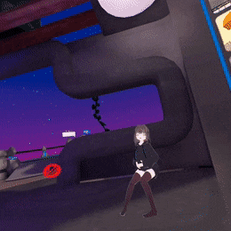
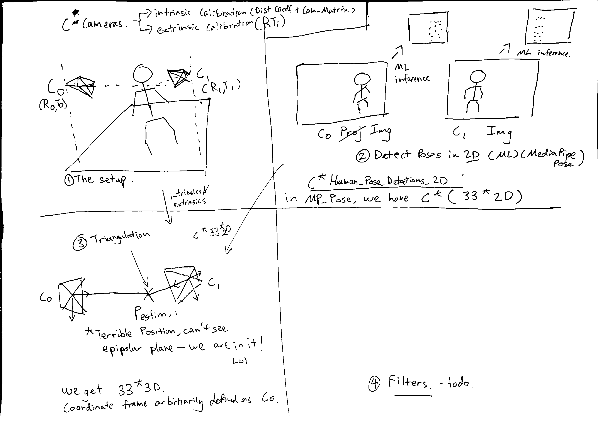

## Uwupose experiment repo
We perform Foot and Hip tracking for steamVR in real-time. Using only 
ML and cameras. no trackers attached.

*"Highly experimental, mostly impractical - you have been warned!"*

**Demo**

Uwupose is able to simulate ankle and hip trackers at 10-12hz with 2 cameras.

It estimates your pose in 2D from 2 camera image streams, then performs 
triangulation to 
estimate your overall 3D pose.



**Performance**

Benchmark/Dev machine
- i5 4670k
- 16gb ram
- GTX 1060 3GB
  
Results
- 10 fps leg-and-hip poses to steamVR
- 450ms of end-to-end latency (130ms is webcam latency)
- 40-50% CPU usage in task manager (on a 4 core CPU)
- 400MB of ram is used. (good result)

Conclusion
- poor performance on 4 core CPU, 10 year-old.
  - I would like to test on one of those 6/8 core CPUs of today.
- Running multiple mediapipe-pose solutions on different threads is 
  probably not the correct way;
  - cpu usage goes up linearly (expected)
  - the FPS of inference reduces drastically; to half. (unexpected!)
  - This means that despite CPU doing 2x the work, the performance is drop 
    drastically. Something is blocking.
- running 3 mediapipe pose pipelines will cause steamVR to stutter badly and 
  take up 70-80% cpu. VRChat will crash. Main thread keeps getting 
  timeout-ed (in steamvr, Now loading... appears).
  - Running 2 MP-pose barely allows me to load the VRchat world.
- memory usage is a non-issue.
- MP pose is very bad when the face is not visible. 
- MP pose often thinks I am facing the opposite direction if the face is not 
  visible.
- It is very very difficult to get a correct extrinsic calibration of the 
  cameras. It is even more difficult to figure out/ visualise/ ascertain that 
  these numbers are correct!

**High level of Uwupose**
1. Setup
   * Input: mounted webcams.
   * Use Charuco board and [multical](https://github.com/oliver-batchelor/multical) to obtain the cameras' intrinsic and 
     extrinsic matrix (required to do triangulation)
2. ML inference
   * Use mediapipe (2D pose estimation) to get person's pose in image
3. Triangulation
   * Do triangulation using the outputs of stage 1 and 2. 
   * Use Aniposelib API (C * 2D image points -> 3D world points)
4. (not in picture)
   * rotate, translate the world points to match the headset's reported 
     position.
   * send to steamVR (use driver from Apriltag tracker repo)




**Development environment**
* Windows 10
* Python 3.7 anaconda env. 
* Two USB webcams attached to DIFFERENT USB ports/hub/buses 


**How to run it?**
* setup freemocap from the original repo. (install their dependencies)
* Install the 'Apriltag tracker driver' that [Mediapipe-VR-Fullbody-Tracking](https://github.com/ju1ce/Mediapipe-VR-Fullbody-Tracking) is using 
* obtain intrinsic and extrinsic calibration of at least 2 cameras. 
  * What worked:
    * I used [multical](https://github.com/oliver-batchelor/multical)
      * So the funny thing is that this repo outputs the correct coordinate 
        system. However, you need to convert the rotation_matrix like this:
        * use Scipy `Rotation.toRotationVector(result_Rotation_matrix)`
  * What not work
    * I tried argus and wandsomething, I don't know what its doing.
    * The future is obviously wand calibration or something like that, 
      instead of the clunky charuco board
  * your results, put them in the file `calibration.toml` 
* now run freemocap_runme_script.py of this repo.
  * choose your cameras from the list.
    * choose the top radio button to see that the cameras are opened in the 
      right 
      ordering - same order as the `calibration.toml`
  * now, go ahead to 'start working'
    * you should see cameras image and your joint detected in real-time.
    * you should see that the 3d trackers have spawned in steamVR.
      * if they dont appear there is a few reasons:
        * possible the trackers are > 10m away from origin of SteamVR. The 
          driver is filtering those data out.
        * possible the trackers are in strange location that you simply 
          can't render.
        * possible the triangulation (esp. extrinsics!) is totally wrong. 
          this will cause the triangulation to have very high reprojection 
          error, resulting in no data being sent to SteamVR. 
          * To solve this, god help you (really, I don't know how to fix a 
            bad extrinsic calibration except for trying hard to redo 
            calibration!)
    * you should see the ui screen same like mediapipe-pose-VR repo.
      * stand straight in front of the cameras, click the button 'calibrate'
      * observe the sliders at the top have moved. calibration has been done.
      * now go back to vr and observe your trackers are at the right position.
* with the trackers in a correct position (ankle and hip), lauch your game 
  and do the normal calibration in-game just like normal trackers.
* enjoy your crappy 10hz tracking with only cameras! :D

**Acknowledgements**

Uwupose is built on the prior work:
* https://github.com/ju1ce/Mediapipe-VR-Fullbody-Tracking
* https://github.com/freemocap/freemocap
* https://github.com/lambdaloop/anipose
* https://google.github.io/mediapipe/solutions/pose

##  todo the following - original README from FMC

____
____
# Installation
Open an Anaconda-enabled command prompt or powershell window and perform the following steps:

1) Create a Python3.7 Anaconda environment
``` 
$ conda create -n freemocap-env python=3.7
``` 

2) Activate that newly created environment
```
$ conda activate freemocap-env
```
3) Install freemocap  from PyPi using `pip`
```
$ pip install freemocap
```
That should be it!
___
___
# Basic   Usage


 ##  HOW TO CREATE A *NEW* `FreeMoCap` RECORDING SESSION

tl;dr- **Activate the the freemocap Python environment** and run the following lines of code (either in a script or in a console)

```python
import freemocap
freemocap.RunMe()
```

But COOL KIDS will install Blender ([blender.org](https://blender.org) and generate an awesome `.blend` file animation by setting `useBlender=True`: 

```python
import freemocap
freemocap.RunMe(useBlender=True)
```


This two-line script is a copy of the `freemocap_runme_script.py` file, which can be run by entering the following command into a command prompt or powershell: 
```
(freemoocap-env)$ python freemocap_runme_script.py
```

## In a bit more detail- 

 ### 1)  In an Anaconda enabled Command Prompt, PowerShell, or Windows Terminal window 
- You will know if it's `Anaconda Enabled` because you will see a little `(base)` to the left of each line, which denotes that your `(base)` environment is currently active.
-  We recommend Windows Terminal so you can enjoy all the [Rich](https://github.com/willmcgugan/rich)✨ formatted text output, but you'll need to do a bit of work to connect it to Anaconda (e.g. [these instructions](https://dev.to/azure/easily-add-anaconda-prompt-in-windows-terminal-to-make-life-better-3p6j) )
   - If that seems intimidating (or just too much work), just press the `Windows` key, type `Anaconda Prompt` and run everything from there.
   
 ###  2) Activate your freemocap environment 
  - e.g. if your freemocap environment is named `freemocap-env`, type:
  ```
  (base)$ conda activate freemocap-env
  ```
  - If successful, the `(base)` to the left of each line will change to `(freemocap-env)`, indicating that your freemocap environment is now active (type `conda info --envs` or `conda info -e` for a list of all available environments)

### 3) Activate an `ipython` console
   - Activate  an instance of an `ipython` console by typing `ipython` into the command window and pressing 'Enter'
```
(freemocap-env)$ ipython
```
### 4)  Within the `ipython` console, import the `freemocap` package

```Python
[1]: import freemocap
```

### 5) Execute the `freemocap.RunMe()` command (with default parameters, see [#runme-input-parameters](#runme-input-parameters) for more info)

```python
[2]: freemocap.RunMe() #<-this is where the magic happens!
```

### 6) Follow instructions in the Command window and pop-up GUI windows!
---✨💀✨---.

---
___

## HOW TO REPROCESS A PREVIOUSLY RECORDED `FreeMoCap` RECORDING SESSION

You can re-start the processing pipeline from any of the following processing stages (defined below)by specifying the `SessionID` desired `stage` in the call to `freemocap.RunMe()`

So to process the session named `sesh_2021-11-21_19_42_07` starting from stage 3 (aka, skipping the `1- recording` and `2- synchronization` stages), run:
```python
import freemocap
freemocap.RunMe(sessionID="sesh_2021-11-21_19_42_07", stage=3)
```

Note - if you leave `sessionID` unspecified but set `stage` to a number higher than 1, it will attempt to use the last recorded session (but this can be buggy atm)

___

## [Processing stages](#processing-stages)  - 

 - **Stage 1 - Record Videos**
   -  Record raw videos from attached USB webcams and timestamps for each frame 
   -  Raw Videos saved to `FreeMoCap_Data/[Session Folder]/RawVideos`

 - **Stage 2 - Synchronize Videos**
   - Use recorded timestamps to re-save raw videos as synchronized videos (same start and end and same number of frames). Videos saved to 
   - Synchronized Videos saved to `FreeMoCap_Data/[Session Folder]/SynchedVideos`


 - **Stage 3 - Calibrate Capture Volume**
   -   Use [Anipose](https://anipose.org)'s [Charuco-based](https://docs.opencv.org/3.4/df/d4a/tutorial_charuco_detection.html) calibration method to determine the location of each camera during a recording session and calibrate the capture volume
   -   Calibration info saved to `[sessionID]_calibration.toml` and `[sessionID]_calibration.pickle` 


-   **Stage 4 - Track 2D points in videos and Reconstruct 3D** <-This is where the magic happens ✨
    -   Apply user specified tracking algorithms to Synchronized videos (currently supporting MediaPipe, OpenPose, and DeepLabCut) to generate 2D data 
        -   Save to `FreeMoCap_Data/[Session Folder]/DataArrays/` folder (e.g. `mediaPipeData_2d.npy`)
    -   Combine 2d data from each camera with calibration data from Stage 3 to reconstruct the 3d trajectory of each tracked point
        -   Save to `/DataArrays` folder (e.g. `openPoseSkel_3d.npy`)
    -   NOTE - you might think it would make sense to separate the 2d tracking and 3d reconstruction into different stages, but the way the code is currently set up it's cleaner to combine them into the same processing stage ¯\\\_(ツ)_/¯

-   **Stage 5 - Use Blender to generate output data files (optional, requires [Blender](https://blender.org) installed. set `freemocap.RunMe(useBlender=True)` to use)**
    -   Hijack a user-installed version of [Blender](https://blender.org) to format raw mocap data into  a `.blend` file including the raw data as keyframed emtpies with a (sloppy,  inexpertly) rigged and meshed armatured based on the [Rigify](https://docs.blender.org/manual/en/2.81/addons/rigging/rigify.html) Human Metarig
    -   Save `.blend` file to `[Session_Folder]/[Session_ID]/[Session_ID].blend` 
    -   You can double click that `.blend` file to open it in Blender. 
    -   For instructions on how to navigate a Blender Scene, try this [YouTube Tutorial](https://www.youtube.com/watch?v=nIoXOplUvAw)


-   **Stage 6 - Save Skeleton Animation!**
    -   Create a [Matplotlib](https://matplotlib.org) based output animation video.
     -  Saves Animation video to: `[Session Folder]/[SessionID]_animVid.mp4`
     -  Note - This part takes for-EVER 😅
     
____
____
## `freemocap.RunMe()` Specify recording session  paramters 
___
The `freemocap.RunMe()` function takes a number of parameters that can be used to alter it's default behavior in important ways. Here are the default parameters along with a followed by a brief description of each one. 


### RunMe - Default parameters
```python
#in `freemocap/fmc_runme.py`
def RunMe(sessionID=None,
        stage=1,
        useOpenPose=False, 
        runOpenPose = True, 
        useMediaPipe=True,
        runMediaPipe=True,
        useDLC=False,
        dlcConfigPath=None,
        debug=False,
        setDataPath = False,
        userDataPath = None,
        recordVid = True,
        showAnimation = True,
        reconstructionConfidenceThreshold = .7,
        charucoSquareSize = 36, #mm
        calVideoFrameLength = .5,
        startFrame = 0,
        useBlender = False,
        resetBlenderExe = False,
      	get_synced_unix_timestamps = True,
        good_clean_frame_number = 0,
        bundle_adjust_3d_points=False
        ):
```

### [RunMe input parameters](#runme-input-parameters)
- `sessionID`
  - Type - (str) 
  - [Default] - None.
  - Indentifying string to use for this session. 
  - If creating a new session, default behavior is to autogerate SessionID is based on date and time that the session was recorded
  - If re-processing a previously recorded session, this value specifies which session to reprocess (must be the name of a folder within the `FreeMoCap_Data` folder)
  - 
- `stage`
  - [Type] - Int 
  - [Default] - 1
  - Which processing stage to start from. Processing stages are deined in more  detail in [#processing-stages](#processing-stages) 
  
  ```
  stage 1 - Record Raw Videos
  stage 2 - Synchronize Videos
  stage 3 - Camera Calibration
  stage 4 - 2d Tracking and 3d Calibration
  stage 5 - Create output files (using Blender)
  stage 6 - Create output animation (Matplotlib)
  ```  
- `useMediaPipe`
  - [Type] - BOOL
  - [Default] - False, 
  - Whether or not to use the MediaPipe tracking method in `stage=4`

- `runMediaPipe`
  -	[Type] - BOOL
  - [Default] - False, 
  - Whether or not to RUN the MediaPipe tracking method in `stage=4`  (will use previously processed data. This can save a lot of time when re-processing long videos) 
    
- `useOpenPose`
  -	[Type] - BOOL
  - [Default] - False, 
  - Whether or not to use the OpenPose tracking method in `stage=4`

- `runOpenPose`
  -	[Type] - BOOL
  - [Default] - False, 
  - Whether or not to RUN the OpenPose tracking method in `stage=4`  (will use previously processed data. This can save a lot of time when re-processing long videos) 
  
-  `useDeepLabCut`
    - [Type] - BOOL
    - [Default] - False, 
    - Whether or not to use the DeepLabCut model/project specified at `dlcConfigPath`  to track objects in `stage=4`


-  `setDataPath`
	-	[Type] - BOOL
   - [Default] - False, 
   - Trigger the GUI that prompts user to specify location of `FreeMoCap_Data`

-  `userDataPath`
	-	[Type] - BOOL
     - [Default] - False, 
     - path to the location of `FreeMoCap_Data`

-  `recordVid`
	-	[Type] - BOOL
     - [Default] - False, 
     - wehether to save the matplotlib animation to an `.mp4` file

-  `showAnimation`
	-	[Type] - BOOL
     - [Default] - False, 
     - wehether to save the matplotlib animation to an `.mp4` file

- `reconstructionConfidenceThreshold`
  - [Type] - float in range(0,1),
  - [Default] - .7
  - Threshold 'confidence' value to include a point in the 3d reconstruction step
  
- `charucoSquareSize`
  - [Type]  = int
  - [Default] = 36,
  - The size of a side of a black square in the Charuco board used in this calibration. The default value of 36 is approximately appropriate for a print out on an 8 in bu 10 in paper (US Letter, approx A4)
  
- `calVideoLength`
  - [Type]  = int, float in range (0,1), or [int, int]
  - [Default] = .5,
  - What portion of the videos to use in the Anipose calibration step in `stage=3`. `-1` uses the whole recording, a number between 0 and 1 defines a proprotion of the video to use, and a tuple of two numbers defines the start and end frame


- `startFrame`
  - [Type]  = int
  - [Default] = 0,
  - what frame of the video to start the animation in `stage=6`

- `useBlender`
  - [Type]  = BOOL
  -  [Default] = True,
  -  Whether to use Blender to create output `.blend`, `.fbx`,`.usd`,and `.gltf` files

- `resetBlenderExe`
  - [Type]  = BOOL
  -  [Default] = False,
  -  Whether to launch GUI to set Blender .exe path (usually something like `C:/Program Files/Blender Foundation/2.95/`)

- `get_synced_unix_timestamps`
  - [Type]  = BOOL
  -  [Default] = True,
  -  Whether to save camera timestamps in `Unix Epoch Time` in addition to the default 'counting up from zero' timestamps. Very helpful for synchronizing FreeMoCap with other softwares

- `good_clean_frame_number`
  - [Type]  = int
  -  [Default] = 0,
  -  A frame where the subject is standing in something like a T-pose or an A-pose, which will be used to scale the armature created via the `useBlender=True` option. If set to default (`0`) the software will attempt to locate this frame automatically by looking for a frame where all markers are visible with high `confidence` values (but this is buggy)

- `bundle_adjust_3d_points` [EXPERIMENTAL as of May 2022]
  - [Type]  = BOOL
  -  [Default] = False,
  -  When set to `True`, the system will run a bundle adjust optimization of all recorded 3d points produced in `stage=4` using `aniposelib`'s `optim_points` method. This takes a rather long time, but can signicantly clean up the resulting recordings. However,it may also "over smooth" the data. We're in the process of testing this method out now


____
____
## Charuco Board Information
___
  * Our calibration method relies on [Anipose](https://anipose.org)'s [Charuco-based](https://docs.opencv.org/3.4/df/d4a/tutorial_charuco_detection.html) calibration method to determine the location of each camera during a recording session. This information is later used to create the 3d reconstruction of the tracked points

  * IMPORTANT The Charuco board shown to the camera MUST be generated with the `cv2.aruco.DICT_4X4_250` dictionary! 
  
  * Ah high resoultion `png` of this Charuco board is in this repository at `/charuco_board_image_highRes.png`
* 
  * To generate your own board, use the following python commands (or equivalent). DO NOT CHANGE THE PARAMETERS OR THE CALIBRATION WILL NOT WORK:
	``` python
	import cv2
	
	aruco_dict = cv2.aruco.Dictionary_get(cv2.aruco.DICT_4X4_250) #note `cv2.aruco` can be installed via `pip install opencv-contrib-python`
	
	board = cv2.aruco.CharucoBoard_create(7, 5, 1, .8, aruco_dict)
	
	charuco_board_image = board.draw((2000,2000)) #`2000` is the resolution of the resulting image. Increase this number if printing a large board (bigger is better! Esp for large spaces!
	
	cv2.imwrite('charuco_board_image.png',charuco_board_image)
	
	```

# **Optional**

Both [Deeplabcut](https://deeplabcut.org) and [OpenPose](https://github.com/CMU-Perceptual-Computing-Lab/openpose) are technically supported, but both are rather under-tested at the moment. 

* To use DeepLabCut, install with set `freemocap.RunMe(useDLC=True)`
  * Installation instructions for DeepLabCut may be found on their github - https://github.com/DeepLabCut/DeepLabCut

* If you would like to use OpenPose for body tracking, install Cuda and the Windows Portable Demo of OpenPose and set `freemocap.RunMe(useOpenPose=True)`. 
  * Install CUDA: https://developer.nvidia.com/cuda-downloads

  * Install OpenPose (Windows Portable Demo): https://github.com/CMU-Perceptual-Computing-Lab/openpose/releases/tag/v1.6.0


Follow the GitHub Repository and/or Join the Discord (https://discord.gg/HX7MTprYsK) for updates!

# Stay Tuned for more soon!


✨💀✨
